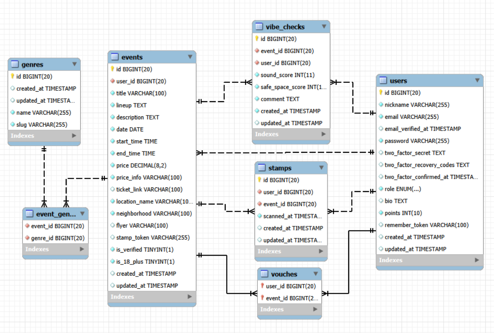
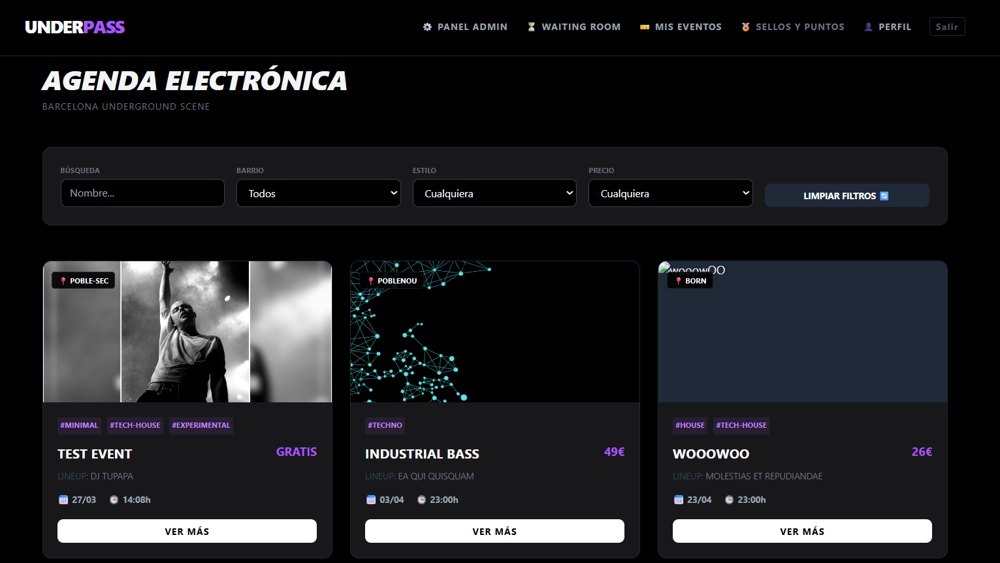
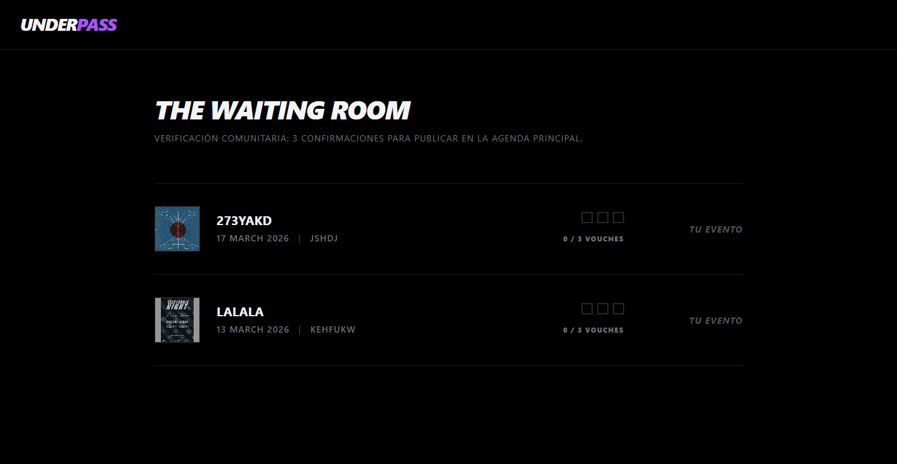
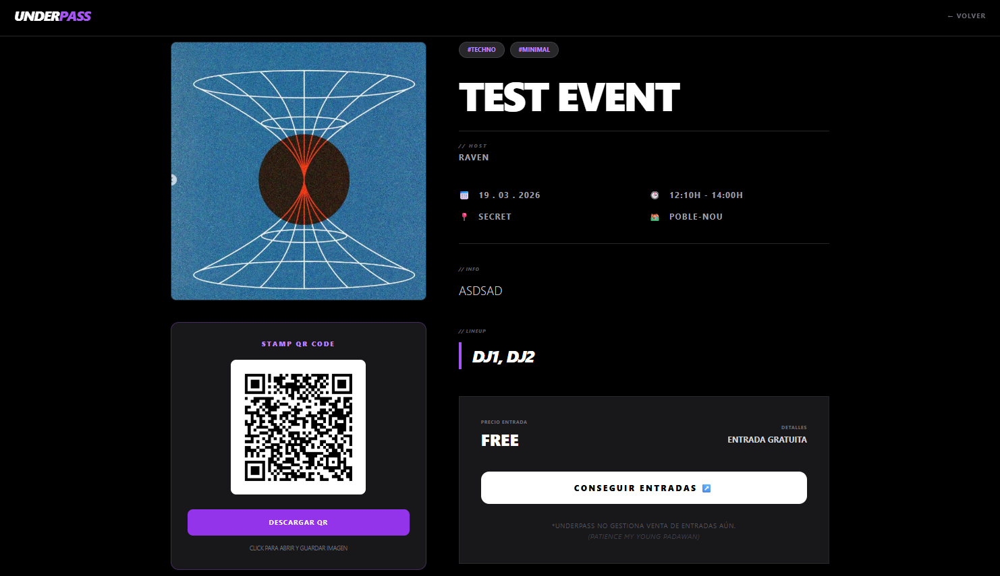
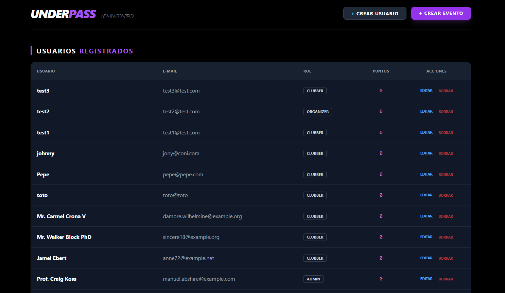
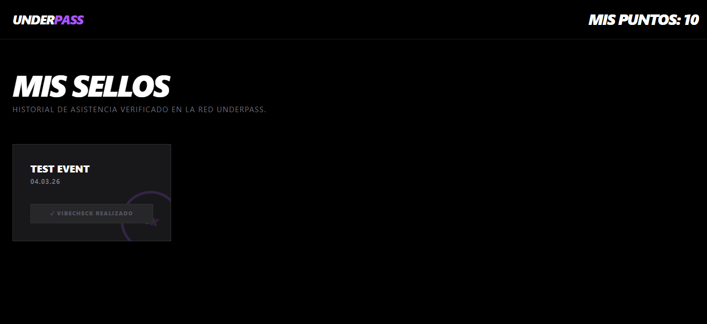

## UnderPass | Barcelona Community Event Agenda
UnderPass is a specialized platform designed for the management and community-driven curation of electronic music events within the Barcelona local scene. The application allows users to publish events, verify them through a collective trust system, and participate in a gamification loop based on physical attendance and qualitative feedback.

## 🛠 Technologies
Backend: Laravel 12 (PHP 8.2)

Frontend: Livewire (Reactive Components), Blade & Tailwind CSS

Architecture: Service Layer Pattern to decouple business logic from controllers.

Database: MySQL

Validation: Form Request Classes for clean data handling and centralized authorization.

## 🚀 Installation
Clone the repository: git clone [https://github.com/francobrida/UnderPass]

Install PHP dependencies: composer install

Install Frontend dependencies: npm install && npm run build

Environment Setup: Copy .env.example to .env and run php artisan key:generate.

Migrations & Seeders: php artisan migrate --seed

Run Server: php artisan serve

## 🧠 Business Logic & Main Features

1.Verification System (Vouches)
To ensure agenda quality, new events are not immediately public.

The Waiting Room: Newly created events enter a "pending" state.

Vouches: Trusted users can grant a "Vouch" (vote of confidence). Once an event reaches 3 Vouches, it is automatically verified (is_verified = true) and published on the main feed.

2.Gamification: QR Codes & Stamps
Once an event is verified, the organizer gains access to a unique QR Code on the event's detail page.

Stamp Collection: Attendees scan this QR code at the physical location.

Logic: Scanning the QR awards the user a Stamp (collectible digital badge) in their passport. This Stamp serves as technical proof of attendance and is a prerequisite for providing feedback.

3.Post-Event Feedback (Vibechecks)
The system collects qualitative data to maintain high community standards.
A Vibecheck (review) becomes available 6 hours after the event ends, exclusively for users who hold the event's Stamp.

Reward: Completing a Vibecheck (rating sound, safe space, and comments) awards the user 5 points.

4.Admin Management Panel
The platform includes a restricted Administrative Dashboard for global oversight.

Full CRUD: Administrators have the authority to create, read, update, and delete any Event or User record.

Moderation: Direct control over event verification status and user role management to ensure community safety.

## 📊 Entity-Relationship Model 

¡Claro! Aquí tienes el bloque de Test Credentials y la Guía de Uso formateada en Markdown limpio (sin tablas), lista para que la copies y pegues directamente en tu archivo README.md.

Lo he organizado con puntos de lista para que sea súper legible tanto en VS Code como en GitHub.

## 🔐 Test Credentials
To evaluate the platform, use the following pre-seeded accounts (run php artisan migrate --seed first):

1.Admin

Email: admin@underpass.com

Password: password

Access: Full Dashboard, User Management, and Event CRUD.

2.Event Organizer

Email: organizer@test.com

Password: password

Access: Create Events, View QR Codes, and check Event Feedback.

3.Clubber (User)

Email: clubber@test.com

Password: password

Access: Vouch for events, Claim Stamps (Gamification), and submit Vibechecks.

## 🕹️ Quick Testing Guide

Follow this flow to test the core "Gamification Loop" and the "Service Layer" logic:

Step 1 (Vouching): Login as Clubber. Go to the Waiting Room and "Vouch" for a pending event. (Events need 3 vouches to be published).

Step 2 (Verification): Login as Admin. You will see the event in the Admin Panel. You can also verify it manually if needed.

Step 3 (The Stamp): As a Clubber, go to a verified event's detail page. Click on the QR Code (this simulates the physical scan at the club).

Step 4 (Passport): Visit your My Stamps (Passport) section. You will see the new Stamp collected and your points increased.

Step 5 (Feedback): If the event has ended, you can submit a Vibecheck (review) to earn 5 extra points.

## 📸 Demo & Screenshots

Main Agenda: 

Waiting Room: 

Organizer Event View (with QR) : 

Admin Panel (User and Event CRUD):

User Passport (Stamps and Points): 

## 📈 Scalability & Future Improvements

Frontend Consistency: Some views are inconsistent with the overall design language.

Organizer Rating System: Implementation of a reputation score for organizers based on the average ratings of their past Vibechecks.

Point Benefist:A dedicated module to exchange accumulated points for exclusive community benefits or partner discounts.

Local Expansion? : The neighborhood-based filtering architecture is designed to scale to other underground hubs by simply updating the location datasets.